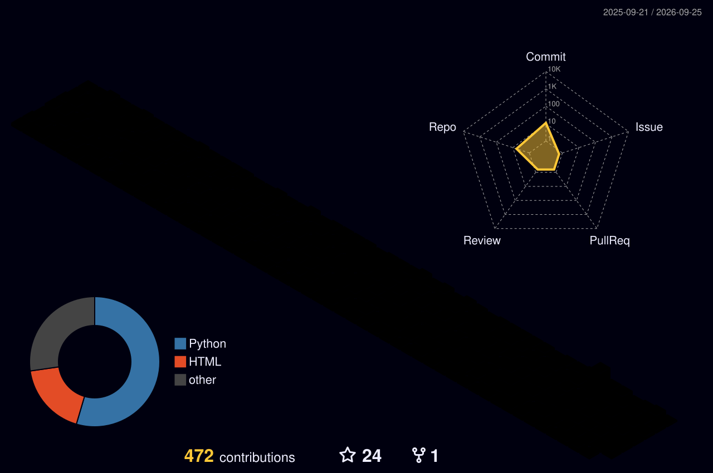

<h1 align="center">
  
</h1>

---

### 👨‍💻 About Me

I'm a Computer Science graduate (Federal University of Pelotas — UFPel, 2025), currently a **Master's student in Computer Science** at the **Department of Computer Science, Federal University of Minas Gerais (DCC/UFMG)**, affiliated with **VeRLab — Laboratory for Computer Vision and Robotics**, under the supervision of **Prof. Erickson Rangel do Nascimento**.

My research sits at the intersection of:

```
Computer Science → Computer Vision → Video Coding / Image Processing
        → Feature Matching → Efficient AI → Edge / Embedded AI → Research Engineering
```

I work on making learned vision systems — from local feature matchers to video codecs — understand, run, and hold up under real computational constraints: limited memory, quantized weights, and NPUs instead of GPUs.

---

### 🔬 Current Research

**Feature Matching on Embedded Hardware (XFeat on the edge)**
Investigating the deployment of **XFeat**, a lightweight local feature extraction/matching network, on extremely resource-constrained hardware — the **Luckfox Pico (Rockchip RV1103)** — running inference on its **NPU without relying on a GPU**. This involves the full pipeline and its failure modes: PyTorch → ONNX → RKNN conversion, **INT8 quantization**, operator compatibility, memory limitations, and numerical behavior across stages. I run systematic experiments comparing PyTorch, ONNX, and on-device NPU outputs (heatmaps, descriptors, NMS behavior) to understand *why* specific components of the model degrade after quantization and deployment.

**Feature Matching Research (broader line of work)**
This project is evolving into a wider research direction on efficient feature matching — covering local feature detection/description, contrastive and information-theoretic perspectives on feature selection, robustness under quantization, and hardware-aware neural network optimization. I maintain a dedicated **Feature Matching Research** GitHub Project as a living structure for experiments, reading notes, hypotheses, benchmarks, and future papers — not a single-purpose code repository, but an evolving research workspace.

**Video Coding / Versatile Video Coding (VVC)** — prior research line
Earlier research on **VVC**, built on **VTM 23.10 + 360Lib 13.6**, focused on ML-assisted **intra prediction for 360° video** and transform-coding optimization (**DST-VII / DCT-VIII**, **Multiple Constant Multiplication**). This work produced **FastMIP-360**, achieving roughly **5.74% encoding time reduction** at approximately **+0.171% BD-BR**, and led to accepted publications at **LASCAS 2025** and **WebMedia 2024**. This line laid the groundwork for my current focus on efficient, hardware-aware vision systems.

---

### 🧭 Emerging Interest

I'm exploring how large scientific codebases (e.g., **VTM**, **VVC**, **VVenC**) could be represented through **semantic / graph-based structures** — code knowledge graphs, LLM-assisted code analysis, and automated documentation — as an alternative to navigating thousands of lines of source directly. This is an early-stage, exploratory interest rather than an active project or publication.

---

### 🛠️ Research Engineering

Beyond models themselves, I build the infrastructure around them: experiment automation, benchmarking pipelines, reproducible results, and tooling for organizing scientific work — turning complex research into systems that can be run, checked, and extended.

---

### 🧰 Technical Toolkit

**AI / Machine Learning**
`Python` `PyTorch` `ONNX` `TensorFlow` `scikit-learn` `NumPy`

**Computer Vision**
`OpenCV` `XFeat` · feature detection/description/matching · object detection · tracking · image processing

**Efficient AI / Edge AI**
`RKNN` · Rockchip NPU (`RV1103`) · INT8 quantization · ONNX deployment · embedded inference · hardware-aware optimization

**Research Engineering**
`Docker` `Linux` `Bash` `Git` `GitHub` — experiment automation, benchmarking, reproducible research

**Backend / AI Infrastructure**
`FastAPI` `Flask` `SQLite` `ChromaDB` `Ollama` — local LLMs, RAG

---

### 🛠️ Languages and Tools

<div align="center">
    <br>
    <br>
</div>

---

### 🌐 Let's Connect

📫 Feel free to reach out:
- [LinkedIn](https://www.linkedin.com/in/franklin-oliveira12/)
- [Portfolio](https://portfolio-frank-seven.vercel.app/)
- 📧 `fsoliveira@inf.ufpel.edu.br`
- [Lattes CV](https://lattes.cnpq.br/2871228093388049)
- [YouTube](https://www.youtube.com/@franklinsalesdeoliveira472)
- [Instagram](https://www.instagram.com/frankl_sales/)

---

### 📊 GitHub Stats

<div align="center">
  <a href="https://git.io/streak-stats">
    
  </a>
</div>

---

### 🧩 3D Contribution Graph




