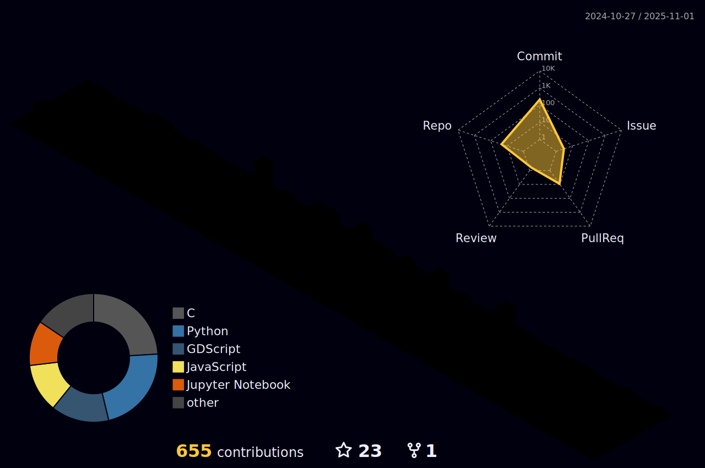

<h1 align="center">
  
</h1>

---

### 🧩 3D Contribution Graph

---

### 👨‍💻 About Me

I'm currently in the final semester of my **Computer Science** degree at the **Federal University of Pelotas (UFPel)**. I'm passionate about how computational systems generate, process, and interpret images - especially in the context of video compression and coding.

As a **Scientific Initiation Scholar** at **ViTech (Video Technology Research Group – UFPel)**, I conduct research on the **Versatile Video Coding (VVC)** standard, with a focus on optimizing **intra-frame coding for 360º videos** using machine learning and lightweight models. I'm working toward integrating these methods into the **VVC Test Model (VTM)**. I have also explored **Multiple Constant Multiplication (MCM)** approaches for **DST-VII** and **DCT-VIII** transforms. These efforts have led to **publications accepted** at events like **LASCAS 2025** and **WebMedia 2024**.

In parallel, I collaborate with the **Cybersecurity Research Group** and the **Veterinary Epidemiology Lab** at UFPel, applying **AI and NLP** to **predictive epidemiology** and **disease historiography**, particularly focusing on **arboviruses**.

Additionally, I work as an **Intern in Image Processing and Computer Vision** at **Primeira Mesa**, where I develop applications using:
- 🟢 **YOLO** for object detection  
- 🟣 **DeepSORT** for multi-object tracking  
- 🔵 **TensorFlow**, **PyTorch**, and **scikit-image** for model training and deep learning tasks  
- 🟡 **OpenCV**, **NumPy**, and other visual data processing tools  

---

### 🧪 Current Projects & Interests
- 🎓 VVC intra prediction for 360º videos
- 🔬 Lightweight ML models for integration in video encoders
- 🧠 NLP + AI for health and epidemiological data
- 🧩 Deep learning for object detection, segmentation, and tracking

---

### 🌐 Let's Connect

📫 Feel free to reach out to me:  
- [LinkedIn](https://www.linkedin.com/in/franklin-oliveira12/)
- [Portfolio](https://portfolio-frank-seven.vercel.app/)
- 📧 `fsoliveira@inf.ufpel.edu.br`  
- [Lattes CV](https://lattes.cnpq.br/2871228093388049)  
- [YouTube](https://www.youtube.com/@franklinsalesdeoliveira472)  
- [Instagram](https://www.instagram.com/frankl_sales/)  

---

### 🛠️ Languages and Tools

     
     

---

### 📊 GitHub Stats

  

---
